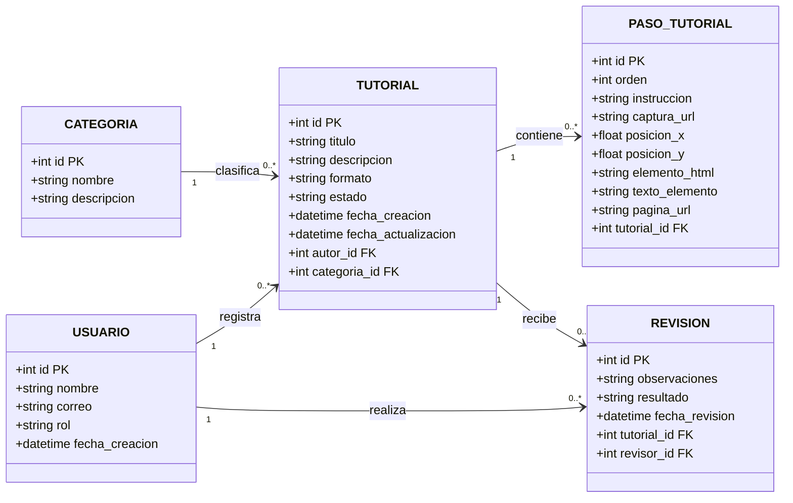
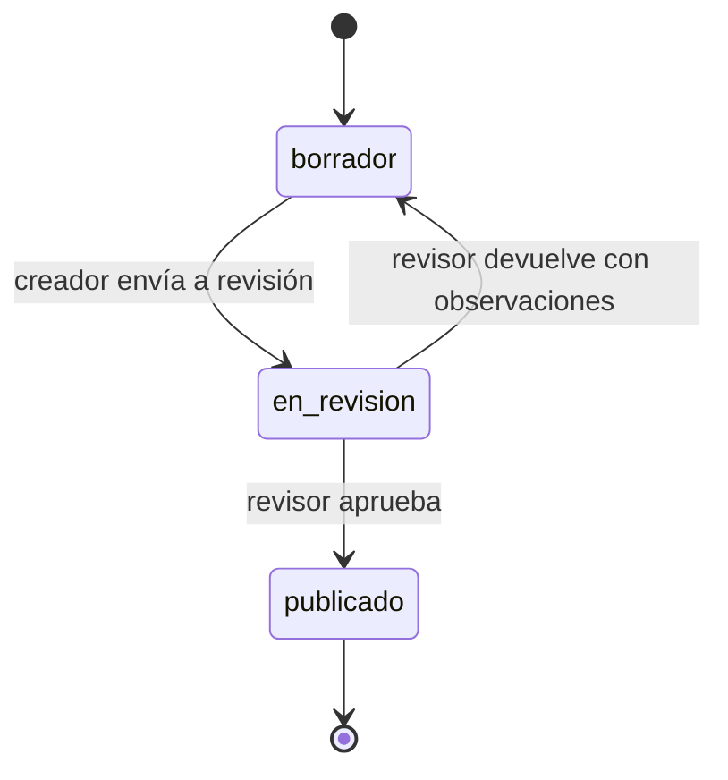

# Hito 1 - Ficha del negocio: TutorHub
*Pareja:* Carlos Enrique Espinoza Ponce · Roberth Mauricio Solorzano Garcia 
*Paralelo:* Aplicaciones Web I B  
*Negocio en una línea:* TutorHub es una plataforma para crear, revisar y publicar tutoriales técnicos interactivos paso a paso, dirigida principalmente a estudiantes y comunidades educativas.

## 1. Negocio de referencia

El negocio de referencia es *Supademo*, caso documentado en Starter Story.

- **Qué vende:** Una plataforma de software (SaaS) y extensión de navegador para crear demostraciones interactivas y tutoriales guiados paso a paso clonando el front-end (HTML interactivo) del producto, permitiendo incrustarlos en sitios web o documentación técnica sin necesidad de videos continuos pesados.

- **A quién:** A empresas de software B2B, fundadores, equipos de ventas y equipos de soporte/onboarding que necesitan demostrar el valor de sus productos.

- **Cómo cobra:** Mediante un modelo de crecimiento impulsado por el producto (Product-Led Growth - PLG), utilizando un nivel gratuito (freemium y herramientas abiertas sin registro) para atraer tráfico y convirtiéndolos a suscripciones recurrentes de pago mensuales o anuales para funciones avanzadas y trabajo en equipo.

- **Cifra declarada por el fundador:** El fundador (Joseph) declara que la plataforma superó los 3 millones de dólares en ingresos recurrentes anuales (ARR), generando más de 250.000 dólares mensuales (MRR), y cuenta con una base de más de 150.000 usuarios.

- **Enlace al video o artículo:**  
https://www.youtube.com/watch?v=l4WEqPX52Cg
---

## 2. Caso de contraste

Un caso comparable es Fable, una plataforma web para crear demostraciones guiadas y tutoriales interactivos de software. A pesar de haber levantado capital inicial y ofrecer recorridos interactivos mediante capturas en el navegador, la empresa no logró sostener su modelo comercial y anunció su cierre definitivo a inicios de 2026, liberando su código como proyecto abierto.

Nuestra hipótesis es que su estancamiento radicó en su estructura de costos y modelo de monetización: dependían de una infraestructura centralizada en la nube con altos costos fijos de almacenamiento y procesamiento continuo, mientras intentaban vender suscripciones mensuales a empresas sin consolidar retención en creadores individuales. TutorHub mitiga este riesgo operando con una arquitectura ligera de procesamiento en el cliente y orientando su sostenibilidad a convenios institucionales B2B directos con entidades educativas.

*Fuente:* https://github.com/sharefable/app
---

## 3. Adaptación al Ecuador

1. **Conectividad móvil limitada y congestión recurrente en redes universitarias:** Gran parte de los estudiantes universitarios en la provincia depende de paquetes de datos móviles prepago con capacidades restringidas fuera del campus; a su vez, la concurrencia masiva de usuarios en los laboratorios y áreas comunes de la universidad suele saturar el ancho de banda local ante la transmisión o descarga de contenidos pesados.
   * *Efecto en el negocio:* TutorHub descarta el video continuo en alta definición como formato didáctico principal y estructura el contenido en guías modulares paso a paso acompañadas de texto e imágenes optimizadas en WebP, permitiendo consultar tutoriales técnicos sin agotar el saldo del estudiante ni provocar caídas de navegación en la red del campus.
   * *Cambio provocado en el proyecto:* En la entidad `PasoTutorial`, se almacena una referencia ligera `captura_url` a imágenes individuales procesadas en el cliente, en lugar de alojar secuencias o archivos continuos de video que saturarían el almacenamiento y la red.

2. **Acceso fraccionado a terminales de cómputo en laboratorios y hogares compartidos:** En el contexto de estudio local, muchos estudiantes no disponen de un equipo de uso exclusivo y dependen de turnos asignados en las salas de cómputo de la facultad o de computadoras familiares compartidas, lo que dificulta completar la redacción y maquetación de guías técnicas en una sola jornada continua e ininterrumpida.
   * *Efecto en el negocio:* La plataforma permite que el recurso creado permanezca de forma indefinida en estado `borrador`, facilitando que el estudiante retome la edición, modifique instrucciones y ensamble los pasos de manera gradual a través de múltiples sesiones de estudio sin bloqueos por inactividad ni forzar una publicación prematura.
   * *Cambio provocado en el proyecto:* En la máquina de estados, el estado inicial `borrador` es persistente y no destructivo, permitiendo al creador guardar cambios parciales en `PasoTutorial` sin límite temporal ni penalización por inactividad.

3. **Control y validación docente previo a la publicación:** En el entorno formativo universitario, los estudiantes elaboran tutoriales y guías como parte de sus tareas o proyectos de cátedra, pero el contenido no puede publicarse de forma automática en el repositorio oficial de la facultad sin la verificación previa de un profesor o ayudante que garantice la precisión técnica y evite errores conceptuales.
   * *Efecto en el negocio:* Se elimina la autopublicación directa y se exige un ciclo de moderación formal donde el material pasa por un proceso de aprobación antes de ser accesible a la comunidad estudiantil.
   * *Cambio provocado en el proyecto:* Se incorporó en el modelo relacional la entidad independiente `Revision`, se creó el rol `Revisor` y se añadió en la entidad `Tutorial` el estado intermedio `en_revision`, impidiendo la transición directa de `borrador` a `publicado`.

**Qué cambió en el modelo por estas restricciones:** Por la restricción 3 (control y validación docente), se incorporó en el modelo de datos la entidad independiente `Revision`, se creó el rol `Revisor` y se añadió en la entidad `Tutorial` el estado `en_revision`, impidiendo la transición directa de `borrador` a `publicado`.

## 4. Modelo de datos

### Entidad: Usuario

| Atributo | Tipo | Obligatorio | Ejemplo |
|----------|------|-------------|---------|
| id | número entero | sí | 1 |
| nombre | texto | sí | Carlos Ponce |
| correo | texto | sí | cespinoza@uleam.edu.ec |
| rol | uno de: Creador, Revisor | sí | Creador |
| fecha_creacion | fecha y hora | sí | 29-09-2026 10:30 |

### Entidad: Categoria

| Atributo | Tipo | Obligatorio | Ejemplo |
|----------|------|-------------|---------|
| id | número entero | sí | 3 |
| nombre | texto | sí | Programación |
| descripcion | texto | no | Tutoriales relacionados con desarrollo web y software |

### Entidad: Tutorial

| Atributo | Tipo | Obligatorio | Ejemplo |
|----------|------|-------------|---------|
| id | número entero | sí | 101 |
| titulo | texto | sí | Configurar Visual Studio Code |
| descripcion | texto | no | Guía para realizar la configuración inicial del entorno |
| formato | uno de: paso-a-paso, video, interactivo | sí | paso-a-paso |
| estado | uno de: borrador, en_revision, publicado | sí | borrador |
| fecha_creacion | fecha y hora | sí | 29-09-2026 10:35 |
| fecha_actualizacion | fecha y hora | no | 29-09-2026 11:10 |
| autor_id | referencia a otra entidad | sí | 1 (Usuario) |
| categoria_id | referencia a otra entidad | sí | 3 (Categoria) |

### Entidad: PasoTutorial

| Atributo | Tipo | Obligatorio | Ejemplo |
|----------|------|-------------|---------|
| id | número entero | sí | 501 |
| orden | número entero | sí | 1 |
| instruccion | texto | sí | Haz clic en el botón Guardar |
| captura_url | texto | sí | /capturas/paso1.webp |
| posicion_x | número decimal | sí | 0.65 |
| posicion_y | número decimal | sí | 0.32 |
| elemento_html | texto | no | button |
| texto_elemento | texto | no | Guardar |
| pagina_url | texto | no | https://ejemplo.com/editor |
| tutorial_id | referencia a otra entidad | sí | 101 (Tutorial) |

### Entidad: Revision

| Atributo | Tipo | Obligatorio | Ejemplo |
|----------|------|-------------|---------|
| id | número entero | sí | 201 |
| observaciones | texto | no | Corregir la instrucción del paso 3 |
| resultado | uno de: Aprobado, Devuelto | sí | Devuelto |
| fecha_revision | fecha y hora | sí | 29-09-2026 14:20 |
| tutorial_id | referencia a otra entidad | sí | 101 (Tutorial) |
| revisor_id | referencia a otra entidad | sí | 2 (Usuario) |

### Relaciones

| Entidades | Cardinalidad | Frase |
|-----------|--------------|-------|
| Usuario — Tutorial | 1—N | Un usuario creador registra muchos tutoriales; cada tutorial pertenece a un único creador. |
| Categoria — Tutorial | 1—N | Una categoría clasifica muchos tutoriales; cada tutorial pertenece a una sola categoría. |
| Tutorial — PasoTutorial | 1—N | Un tutorial contiene muchos pasos; cada paso pertenece a un único tutorial. |
| Tutorial — Revision | 1—N | Un tutorial recibe muchas revisiones históricas; cada revisión evalúa a un único tutorial. |
| Usuario — Revision | 1—N | Un revisor realiza muchas revisiones; cada revisión es efectuada por un único revisor. |

### Diagrama del modelo

### Decisión discutible

 Revision es una tabla aparte y no simples campos de texto dentro de Tutorial, porque si un tutorial es devuelto con observaciones, el creador lo corrige y se vuelve a revisar; una tabla independiente guarda el historial de todas las revisiones anteriores sin borrar los comentarios pasados.

---

## 5. Máquina de estados

**Entidad con estados:** Tutorial

| Estado | Qué significa |
|--------|---------------|
| borrador (inicial) | El tutorial está en fase de creación o edición por su autor; es privado y no visible en el catálogo público. |
| en_revision | El tutorial fue completado y enviado para evaluación; queda bloqueado para edición del creador hasta recibir dictamen. |
| publicado | El tutorial fue aprobado técnicamente por un revisor; está visible y disponible para consulta de toda la comunidad. |

| De | A | Quién la hace | Condición |
|----|---|---------------|-----------|
| borrador | en_revision | creador | El tutorial tiene título, categoría seleccionada y al menos un paso registrado. |
| en_revision | publicado | revisor | El contenido técnico fue verificado y aprobado. |
| en_revision | borrador | revisor | Se detectaron fallas o contenido incompleto y se adjuntan observaciones en Revision. |

### Diagrama de estados

### Transición prohibida

**Borrador → Publicado**

Esta transición no está permitida porque el creador no puede publicar directamente un tutorial. Antes de llegar a `Publicado`, el tutorial debe pasar por `En revisión` y ser aprobado por un usuario con rol Revisor.

---

## 6. Roles y permisos

| Acción | Creador | Revisor |
|--------|---------|---------|
| Consultar tutoriales publicados | todos | todos |
| Ver tutoriales en gestión | solo los suyos | todos |
| Crear tutorial | sí | no |
| Editar tutorial (en borrador) | solo los suyos | no |
| Enviar tutorial a revisión | solo los suyos | no |
| Devolver tutorial con observaciones | no | sí |
| Aprobar tutorial para publicación | no | sí |

### Coherencia con la máquina de estados

* **Borrador → En revisión:** Solo la realiza el **Creador** al ejecutar la acción *Enviar tutorial a revisión* sobre sus propios tutoriales (`solo los suyos`).
* **En revisión → Publicado:** Solo la realiza el **Revisor** mediante la acción *Aprobar tutorial para publicación* (`sí`).
* **En revisión → Borrador:** Solo la realiza el **Revisor** mediante la acción *Devolver tutorial con observaciones* (`sí`), registrando el dictamen en la entidad `Revision`.

## 7. Mapa de vistas por rol

| Vista | Rol | Qué datos muestra | Acciones | Cómo se ve el estado |
|-------|-----|-------------------|----------|----------------------|
| Mis tutoriales | Creador | Título, categoría, formato y estado de sus tutoriales | Ver, editar y enviar a revisión | Como texto: Borrador, En revisión o Publicado |
| Nuevo tutorial | Creador | Título, categoría, formato y descripción | Crear tutorial | Al crearse inicia en Borrador |
| Editor de tutorial | Creador | Pasos, instrucciones, capturas y orden del tutorial | Editar pasos, ordenar y guardar cambios | Muestra el estado actual del tutorial como texto |
| Detalle del tutorial | Creador / Revisor | Información general, pasos y capturas del tutorial | Previsualizar el tutorial | El estado aparece escrito como texto |
| Bandeja de revisión | Revisor | Tutoriales enviados por los creadores para revisión | Abrir un tutorial para revisarlo | En revisión |
| Revisión del tutorial | Revisor | Datos, pasos, capturas y observaciones del tutorial | Aprobar o devolver con observaciones | En revisión; al decidir pasa a Publicado o Borrador |

**Vistas ya maquetadas en el repositorio y en qué archivo:**
- `Mis tutoriales`: Maquetada en `src/App.svelte` (listado semántico accesible con tabla y estados).
- `Nuevo tutorial`: Maquetada en `src/Formulario.svelte` (formulario accesible con validación semántica ligada).

## 8. Declaración de IA

**IA:** ChatGPT y Gemini se utilizaron como apoyo para revisar la redacción y organizar las secciones de la ficha del Hito 1 a partir de la información técnica definida por el equipo.
